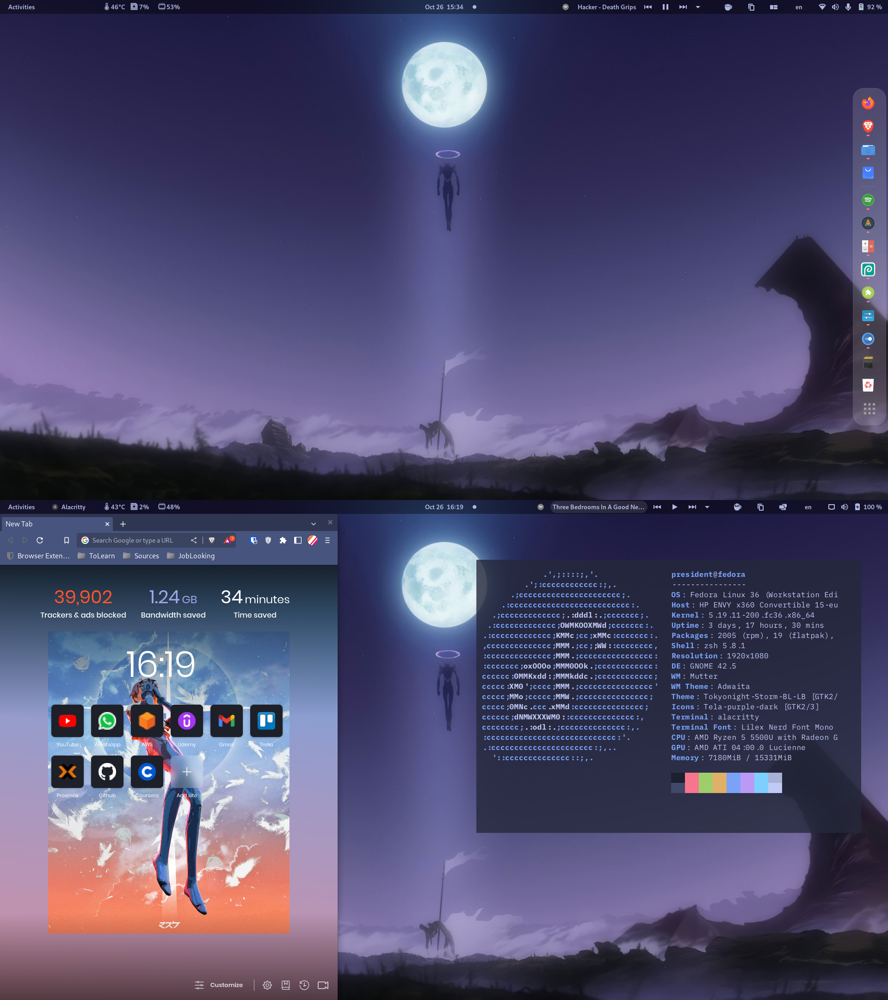
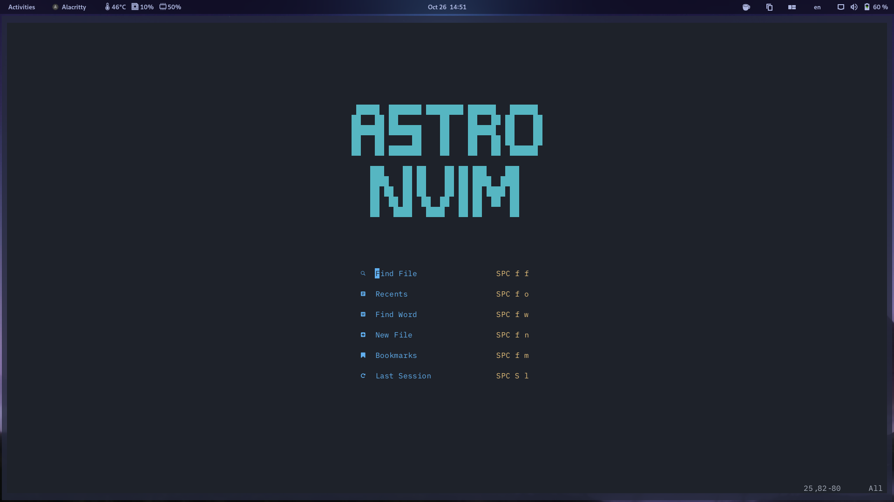
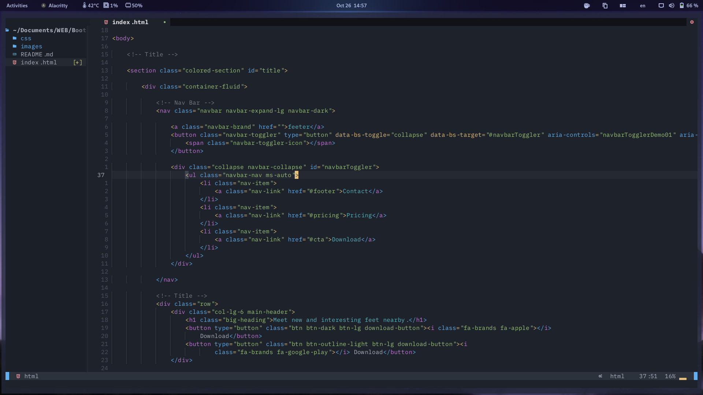
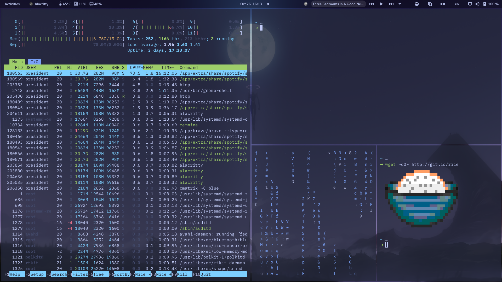
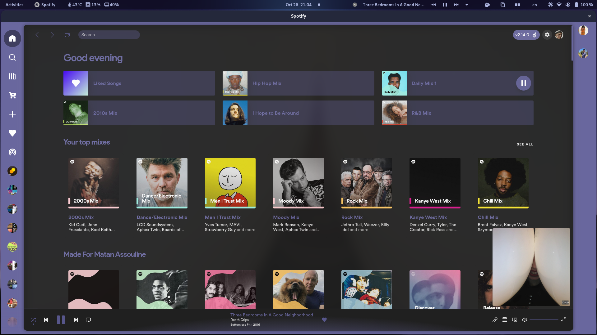

    <h2><i>Gnome Dark-Evangelion dotfiles </i></h2>

 

### About my setup:
- OS: Fedora 36
- DE: Gnome 
- Shell: Zsh
- Terminal: Alacritty
- Colorscheme: [Tokyo-Storm-BL-LB](https://github.com/stronk-dev/Tokyo-Night-Linux)
- Icons: Tela-purple-dark
- Spotify: Spicetify
- IDE: NeoVim

### Extensions I use: 
- [Blur my Shell](https://extensions.gnome.org/extension/3193/blur-my-shell/)
- [Dash to Dock](https://extensions.gnome.org/extension/307/dash-to-dock/)
- [Caffeine](https://extensions.gnome.org/extension/517/caffeine/)
- [Gnome Clipboard](https://extensions.gnome.org/extension/4422/gnome-clipboard/)
- [Media Controls](https://extensions.gnome.org/extension/4470/media-controls/)
- [User Themes](https://extensions.gnome.org/extension/19/user-themes/)

 

# Application configs: 

## AstroVim 🖊️

- [AstroVim (Neovim) config](https://github.com/AstroNvim/AstroNvim)

 
   

 

 
 

 
 
 
 

## Alacritty ⌨️

- [Alacritty config](alacritty.yml)

 
   
 
 
 
 
 
 
 

## Zsh 🌐
- [Zsh config](.zshrc)

 
 
 

## Spotify 🎧

- [Spicetify](https://spicetify.app/)
- [Dribbblish Dynamic Theme](https://github.com/JulienMaille/dribbblish-dynamic-theme)

